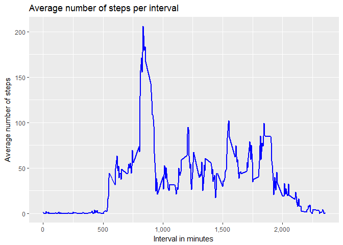
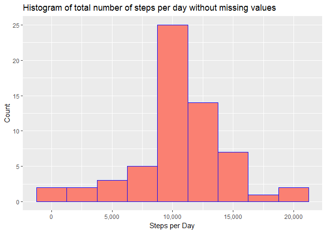
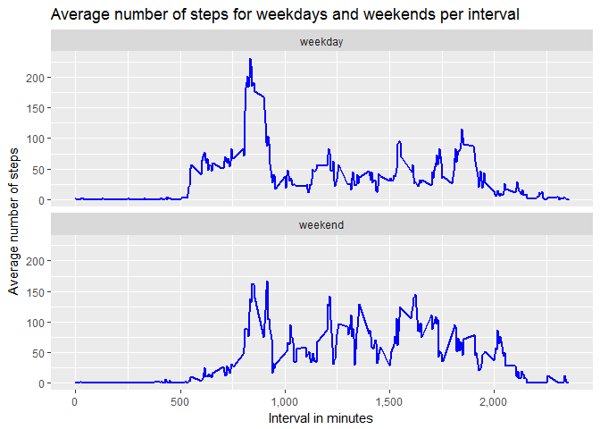

# Reproducible Research: Peer Assessment 1

## Loading and preprocessing the data
The first part of the analysis consists of the folowing steps:
1. loading the necessary libraries 
2. unzipping the data file 
3. reading the data


```r
library(dplyr)
## Unzip and read data file
unzip ("activity.zip")
activity <- read.csv("activity.csv", header = TRUE, sep = ",", stringsAsFactors = FALSE)
## Change to data table for use of dplyr functions
activity <- tbl_df(activity)
```
Now the data is read in make a summary of the data for a first impression.


```r
summary(activity)
```

```
##      steps            date              interval     
##  Min.   :  0.00   Length:17568       Min.   :   0.0  
##  1st Qu.:  0.00   Class :character   1st Qu.: 588.8  
##  Median :  0.00   Mode  :character   Median :1177.5  
##  Mean   : 37.38                      Mean   :1177.5  
##  3rd Qu.: 12.00                      3rd Qu.:1766.2  
##  Max.   :806.00                      Max.   :2355.0  
##  NA's   :2304
```

## What is mean total number of steps taken per day?
Make a histogram of the total number of steps taken per day.

```r
## Load the libraries
library(dplyr)
library(ggplot2)
library(scales)

## group by date and sum steps
actday <- summarise(group_by(activity, date), totsteps = sum(steps, na.rm = TRUE))

## create a histogram of the total number of steps taken per day
g <- qplot(totsteps, data = actday, binwidth = 2500, main = "Histogram of total number of steps per day",
      xlab = "Steps per Day", ylab = "Count",
      fill = I("salmon"), col = I("blue"))
g + scale_x_continuous(labels = comma)
```

<!-- -->

Calculate the mean and the median of the total steps taken per day.

```r
library(pander)
panderOptions('round', 0)
totmean <- pander(mean(actday$totsteps))
totmedian <- pander(median(actday$totsteps))
```
The mean of the total steps taken per day is _9354_ and the median is _10395_.

## What is the average daily activity pattern?
Make a time series plot of the 5-minute interval (x-axis) and the average number of steps taken, averaged across all days (y-axis).

```r
## Load the libraries
library(dplyr)
library(ggplot2)
library(scales)

## group by interval and average steps per interval
actint <- summarise(group_by(activity, interval), avgsteps = mean(steps, na.rm = TRUE))
g <- ggplot(data = actint, aes(interval, avgsteps))
g + geom_line(lwd = 1, colour = "blue") + scale_x_continuous(labels = comma) +
        labs(title = "Average number of steps per interval"
             , x = "Interval in minutes", y = "Average number of steps")
```

<!-- -->

Determine the 5-minute interval, which on average across all the days, contains the maximum number of steps.

```r
## Determine the interval with the maximum number of steps
maxint <- actint[which.max(actint$avgsteps), ]$interval
```
The interval at 835 minutes has the maximum number of steps on average across all days.

## Imputing missing values
Calculate the number of missing values in the dataset (i.e. the total number of rows with NAs).

```r
## Determine which row has a missing value and sum the number of rows.
numNAs <- sum(is.na(activity$steps))
```
There are a total of 2304 values missing from the dataset.

All the missing values are replaced by the average number of steps of the interval and rounded to a whole number as partial steps are impossible.

```r
## Make a copy to preserve the original dataset.
coract <- activity
## Replace the missing values with the mean and round to whole number (partial steps not possible)
coract$steps[is.na(coract$steps)] <- tapply(coract$steps, coract$interval, mean, na.rm = TRUE)
coract$steps <- sapply(coract$steps ,round, 0)
```

To compare the dataset with and without missing values make a histogram of the total steps taken each day without the missing values, i.e. replaced by the mean of the interval.


```r
## Load the libraries
library(dplyr)
library(ggplot2)
library(scales)

## group by date and sum steps
newday <- summarise(group_by(coract, date), totsteps = sum(steps))

## create a histogram of the total number of steps taken per day
g <- qplot(totsteps, data = newday, binwidth = 2500, 
        main = "Histogram of total number of steps per day without missing values",
      xlab = "Steps per Day", ylab = "Count",
      fill = I("salmon"), col = I("blue"))
g + scale_x_continuous(labels = comma)
```

<!-- -->

Calculate the mean and the median of the total steps taken per day with the replaced missing values.

```r
library(pander)
panderOptions('round', 0)
newmean <- pander(mean(newday$totsteps))
newmedian <- pander(median(newday$totsteps))
```
The mean of the total steps taken per day has increased to _10766_ and the median to _10762_.

By imputing missing data the estimate of the daily number of steps has increased as the mean has increased and the spread has decreased.

## Are there differences in activity patterns between weekdays and weekends?
Create a new factor variable in the dataset with two levels - "weekday" and "weekend" indicating whether a given date is a weekday or weekend day.

```r
## Add the variable day to the dataset
coract$day <- weekdays(as.Date(as.character(coract$date)))
## Replace the variable by weekend or weekday
coract[coract$day == "Saturday" | coract$day == "Sunday", ]$day <- "weekend"
coract[coract$day != "weekend", ]$day <- "weekday"
## Make variable day a factor variable
coract$day <- as.factor(coract$day)
```
Make a panel plot containing a time series plot of the 5-minute interval (x-axis) and the average number of steps taken, averaged across all weekday days or weekend days (y-axis).


```r
## Load the libraries
library(dplyr)
library(ggplot2)
library(scales)

## group by day and interval and average steps per day and interval
weekint <- summarise(group_by(coract, day, interval), avgsteps = mean(steps))
## plot the weekend and weekday 
g <- ggplot(data = weekint, aes(interval, avgsteps))
g + geom_line(lwd = 1, colour = "blue") + scale_x_continuous(labels = comma) +
        facet_wrap(~day, ncol = 1) +
        labs(title = "Average number of steps for weekdays and weekends per interval"
             , x = "Interval in minutes", y = "Average number of steps")
```

<!-- -->

